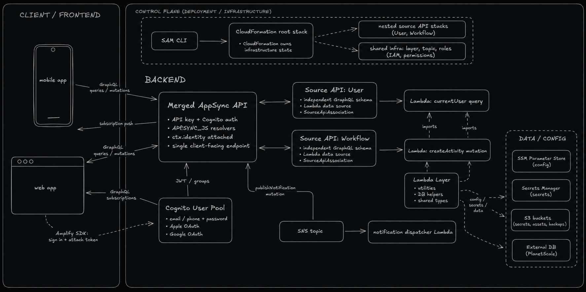

# aws-serverless-demo

[](https://github.com/frixaco/aws-serverless-demo/actions/workflows/check.yml)

This is a small AWS SAM, CloudFormation, and AppSync project that demonstrates
the serverless architecture shape I used in a work project: a merged GraphQL API
composed from independent source schemas, nested CloudFormation stacks, Lambda
resolvers with shared-layer imports, and an SNS publish back into GraphQL
subscriptions.

I first designed this repo on July 31, 2023, based on things I was learning
while building that work project. It is meant to be a small starter template
for this architecture shape: enough structure to copy, inspect, and adapt,
without carrying the full weight of a production backend.

It shows the architecture in miniature:

- one client-facing merged AppSync API
- two independent source GraphQL APIs
- nested CloudFormation stacks managed through SAM
- a shared Lambda layer
- a Lambda-backed query resolver
- a Lambda-backed mutation resolver with a third-party dependency
- an SNS fanout path that publishes back into GraphQL subscriptions

## Architecture



## What to look at first

- `templates/root.yaml` is the app API root stack.
- `templates/user-api.yaml` and `templates/workflow-api.yaml` are domain source
  API stacks.
- `templates/user-api.graphql` and `templates/workflow-api.graphql` are
  independent schemas that merge into the client-facing API.
- `shared/` is the Lambda layer pattern used for common helpers.
- `create_activity/` and `notification_dispatcher/` demonstrate the
  async notification path.

## Tooling

`mise` installs `uv`; `uv` manages Python and dependencies.

```bash
mise install
uv sync
```

## Develop

Run the local checks:

```bash
uv run ty check .
uv run pytest tests/unit -q
uv run ruff check .
cfn-lint templates/*.yaml
sam validate --template templates/root.yaml
```

`ty` is the type checker for this repo. Its Lambda-layer import path is
configured in `pyproject.toml` with `tool.ty.environment.extra-paths`.

## Deploy

Set the environment-specific values explicitly before deploying:

```bash
export COGNITO_USER_POOL_ID="us-east-1_example"
export AWS_REGION="us-east-1"
export AWS_PROFILE="your-profile" # optional

./deploy.sh
```

Optional deploy variables:

- `PROJECT_NAME`, default `aws-serverless-demo`
- `STACK_NAME`, default `aws-serverless-demo`
- `AWS_REGION`, default `us-east-1`
- `AWS_PROFILE`, omitted by default

The deploy script writes `templates/packaged-root.yaml` during packaging. That
file is generated output.
